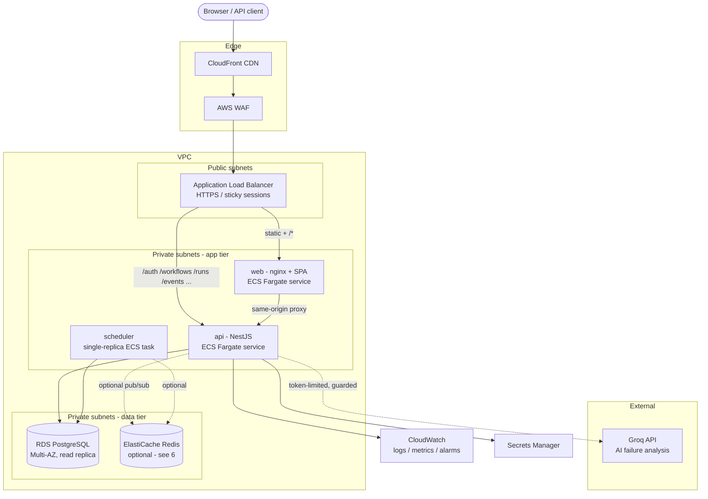
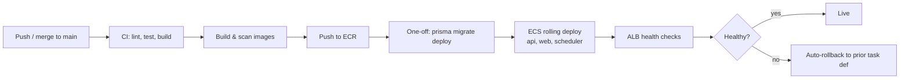

# FlowForge — Production Infrastructure Design

> **Scope.** This is a *design document*, not a live deployment. It describes how
> FlowForge would run in production on AWS, the reasoning behind each choice, and
> the trade-offs (and their remedies) that follow from the current implementation.
> The local stack that actually ships is `docker-compose.yml` at the repo root.

---

## 1. Goals & constraints

| Goal | Implication |
| --- | --- |
| Multi-tenant SaaS, strict data isolation | Tenant scoping enforced in every query + at the realtime layer |
| Real-time run monitoring (sub-second) | Push transport (SSE) from API to browser |
| High-volume execution logs | Dedicated append-only, time-partitioned store |
| Secure by default | Private subnets, secrets manager, least-privilege IAM, WAF |
| Reproducible, automated delivery | Immutable container images from CI, IaC-provisioned infra |
| Cost-proportionate to scale | Start single-instance; scale out only where load demands |

---

## 2. Target architecture (AWS)

### Request flow

- **Static assets & SPA** — `web` (nginx) serves the compiled React bundle. It
  also reverse-proxies the API so the browser uses same-origin paths (mirrors the
  dev Vite proxy and the production `frontend/nginx.conf`). CloudFront caches the
  hashed `/assets/*` at the edge.
- **API** — stateless NestJS behind the ALB. JWT auth, RBAC, per-tenant rate
  limiting, Zod validation on every input.
- **Realtime** — the browser holds an SSE connection to `GET /events/runs`; the
  API streams run/step status transitions as they happen.
- **Scheduler** — a **single** dedicated task owns cron triggering (see §5).
- **AI** — failure analysis calls Groq synchronously with strict token and
  malformed-output guards; it degrades to `503` when unconfigured, never blocking
  core flows.

---

## 3. Component → AWS service mapping

| Component | Local (compose) | AWS (production) | Why |
| --- | --- | --- | --- |
| Frontend | `web` (nginx) | ECS Fargate + CloudFront | No servers to patch; edge caching |
| API | `api` (NestJS) | ECS Fargate service (≥2 tasks) | Stateless, autoscaling on CPU/conn |
| Scheduler | in `api` process | ECS Fargate service (1 task) | Cron must fire exactly once (§5) |
| Database | `db` (Postgres) | RDS PostgreSQL, Multi-AZ | Managed backups, failover, PITR |
| Execution logs | `execution_logs` table | Same RDS, partitioned (§4) | One store, operationally simple |
| Migrations | `migrate` one-shot | ECS one-off task in CD | Runs `prisma migrate deploy` pre-cutover |
| Secrets | `.env` | Secrets Manager + IAM | No secrets in images or env files |
| TLS / DNS | — | ACM + Route 53 | Managed certs, health-checked DNS |
| Images | local build | ECR | Immutable, scanned artifacts |
| Observability | container logs | CloudWatch + X-Ray | Central logs, traces, alarms |

---

## 4. Data layer

### Primary store — RDS PostgreSQL (Multi-AZ)

A single relational database holds tenants, users, workflow definitions and their
append-only version history, and run/step records. Rationale:

- **Strong relational integrity** for the workflow → version → run → step graph.
- **JSONB** for the DAG definition — schema-flexible where it needs to be, indexed
  and queryable where it matters.
- **Tenant isolation** by `tenantId` on every table, enforced in the data-access
  layer (and optionally hardenable with Postgres Row-Level Security).

**Read replica** absorbs dashboard/analytics reads (health panel, run history) so
reporting never contends with the write path.

### Execution logs — same engine, separated & partitioned

Execution logs are high-volume and write-heavy, so they live in a dedicated
`execution_logs` table kept **out of** the transactional run/step tables, and are
**range-partitioned by time** (e.g. monthly). This gives:

- Cheap retention: drop an old partition instead of a mass `DELETE`.
- Bounded index sizes → fast tail reads for a specific run.
- Writes that never bloat the tables backing the live dashboard.

> **Why not a separate log system (e.g. OpenSearch, S3, ClickHouse)?** At this
> scale the operational cost of a second datastore (its own HA, backups, access
> control, sync semantics) outweighs the benefit. Postgres partitioning delivers
> the volume characteristics we need while keeping **one** system to run and back
> up. The write path is isolated behind a repository interface, so promoting logs
> to S3 + Athena (cold, cheap, analytical) or OpenSearch (full-text) later is a
> contained change — not a rewrite.

### Query optimization & migrations

- At least one non-trivial query (the 24-hour health aggregation) is backed by a
  purpose-built composite index; `EXPLAIN` reasoning is documented alongside the
  query.
- Schema changes ship as **Prisma migrations**, applied in CD by a one-off
  `prisma migrate deploy` task **before** new app tasks take traffic. Migrations
  are written to be backward-compatible (expand/contract) so a rollback of the app
  never faces a schema it can't read.

---

## 5. Realtime & scheduling — and how they scale

The current implementation is deliberately **in-process**, which is the right
default for the scope. Two components carry scaling caveats that the production
topology addresses explicitly:

**Realtime (SSE).** `RunEventsService` is an in-memory RxJS pub/sub: the executor
publishes events, SSE subscribers receive the ones matching their tenant. This is
correct and cheap on a **single** API instance. With multiple API tasks, an event
emitted on task A wouldn't reach a browser connected to task B.

- *Interim mitigation:* ALB **sticky sessions** pin a browser's SSE stream to the
  task that will emit its events when runs are triggered from that same task.
- *Full fix:* put a shared **Redis pub/sub** behind the existing
  `RunEventsService` interface — task A publishes, all tasks fan out to their local
  subscribers. The seam already exists (see the note in `run-events.service.ts`),
  so this is an implementation swap, not a redesign.

**Scheduling (cron).** `WorkflowSchedulerService` registers one in-process cron
job per workflow. If every API task ran the scheduler, each cron would fire on
*every* task → duplicate runs.

- *Production fix:* run scheduling as a **separate single-replica service** (shown
  as `scheduler` above). The API tasks stay purely request-serving and horizontally
  scalable; the scheduler owns "fire exactly once." For HA it can use a short
  leader-election lock (e.g. a Postgres advisory lock or Redis lease) so a standby
  can take over without double-firing.

---

## 6. Why there is **no message broker**

Requirement E asks for a broker in the deployment "**if used**." FlowForge does
**not** use one, and that is a deliberate design decision rather than an omission:

- **Realtime doesn't need one at current scale.** Fan-out is in-process RxJS. A
  broker (Redis pub/sub) only becomes necessary to fan events across *multiple* API
  instances — and even then it slots behind the existing interface without changing
  the app's shape (§5).
- **Execution isn't queue-distributed.** The engine runs a workflow's DAG
  in-process with bounded intra-workflow parallelism, retries with exponential
  backoff, and a global timeout. There is no work to hand off to external workers,
  so there is no queue to broker. Introducing BullMQ/SQS now would add a moving
  part (its own availability, retries, dead-letter handling, monitoring) with no
  problem to solve.
- **Scheduling is cron, not a job queue.** Delayed/cron triggers are handled by the
  scheduler service (§5), not by a broker's delayed-job mechanism.
- **Simplicity is a feature.** Fewer stateful systems means fewer failure modes,
  less to secure, and lower cost — appropriate for the load this system targets.

**When a broker earns its place** (any one of these is the trigger to add Redis,
or SQS + workers):

1. API is scaled to **>1 instance** and SSE must fan out across them.
2. Execution must be **distributed** across a worker fleet (long-running or
   high-throughput steps), needing a durable queue with retries and back-pressure.
3. Scheduler HA wants a **shared lease** for leader election.

Because the realtime, execution, and scheduling boundaries are already isolated
behind interfaces, adding a broker later is an additive change — not a rewrite.
This is exactly why it isn't in the stack today.

---

## 7. Security

- **Network** — app and data tiers in **private** subnets; only the ALB is public.
  Security groups allow ALB→app and app→data only. NAT gateway for egress
  (e.g. Groq).
- **Edge** — AWS WAF (rate/IP rules, common-exploit rulesets) in front of
  CloudFront/ALB; TLS terminated with ACM certs.
- **Secrets** — DB credentials, `JWT_SECRET`, `GROQ_API_KEY` in Secrets Manager,
  injected at task start via IAM task roles. Never baked into images.
- **AuthN/Z** — JWT access tokens; RBAC (Admin/Editor/Viewer) enforced by guards;
  every tenant-scoped query filters on `tenantId`.
- **Input** — Zod validation + sanitization on all inputs; parameterized queries
  via Prisma (no string-built SQL).
- **Images** — ECR image scanning; minimal Alpine base; non-root runtime.

---

## 8. Availability, scaling & DR

- **API** — ≥2 Fargate tasks across AZs, autoscaled on CPU and active connections.
- **Scheduler** — 1 task; standby with leader-election lock for failover.
- **Database** — Multi-AZ synchronous standby for automatic failover; read replica
  for reporting; automated backups + point-in-time recovery.
- **Stateless app tier** — no local state, so scaling out / task replacement is
  safe (session state lives in the JWT, not in memory).
- **DR** — RDS automated snapshots (cross-region copy for cold DR); infrastructure
  reproducible from IaC; images retained in ECR.

---

## 9. Observability

- **Logs** — structured app logs → CloudWatch Logs (per service, per tenant
  correlation id).
- **Metrics** — request rate/latency/error %, run success/failure rate, average
  execution time (the health panel's data), queue-free execution durations,
  DB connections. Alarms on error-rate and DB saturation.
- **Tracing** — X-Ray across ALB → API → RDS/Groq to locate latency.
- **Dashboards** — golden signals per service; run-throughput and failure-rate
  business panel mirroring the in-app health view.

---

## 10. CI/CD → deployment

`.github/workflows/ci.yml` runs on every push/PR: **lint** (Prettier, oxlint,
typecheck) · **test** (Jest) · **build** (backend + frontend, upload `dist`
artifacts) · **docker** (build both production images).

Production delivery extends that pipeline:

- Images are immutable and tagged by commit SHA.
- **Migrations run before** new tasks take traffic; expand/contract keeps them
  safe under a rolling deploy.
- ECS rolling deployment with health checks; automatic rollback to the previous
  task definition on failed health checks.

---

## 11. Summary of key trade-offs

| Decision | Chosen | Alternative | Why |
| --- | --- | --- | --- |
| Message broker | **None** (in-process) | Redis / SQS + workers | No fan-out/distribution need at scale; seams ready to add later (§6) |
| Log store | Partitioned Postgres | OpenSearch / S3+Athena | One system to run; volume handled by partitioning (§4) |
| Realtime | SSE | WebSocket | One-way server→client push; simpler, proxy/CDN-friendly |
| Scheduler | Dedicated single task | Cron on every API task | Fire-exactly-once without duplicate runs (§5) |
| Compute | ECS Fargate | EKS / EC2 | No cluster/node ops; right-sized for the workload |
| Frontend | nginx + CloudFront | S3 static hosting | nginx also same-origin-proxies the API |
